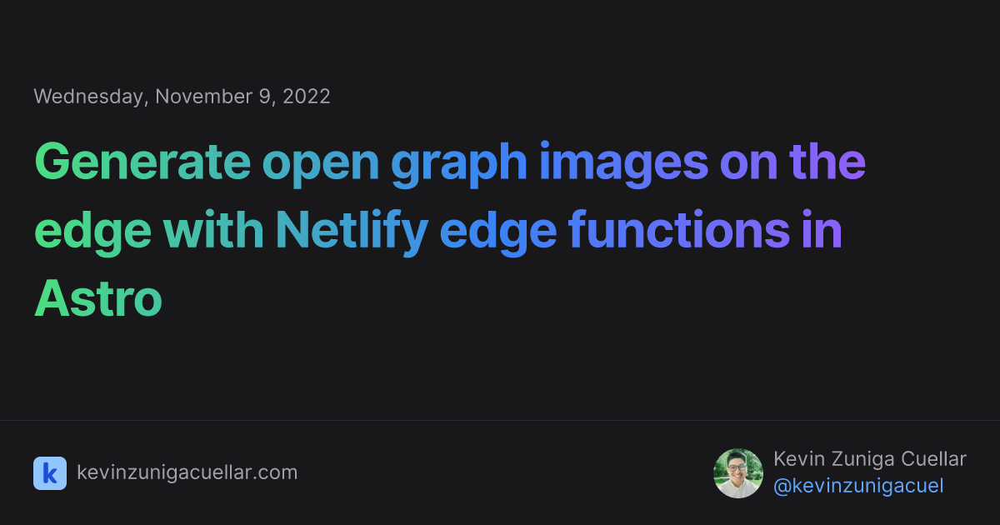

In October 2022, Vercel open sourced their new library [Satori](https://github.com/vercel/satori) which allows users to generate SVGs on the edge using React. This released a lot of potential for generating customizable images faster than ever before.

In this guide, we will be using the library [og-edge](https://github.com/ascorbic/og-edge) which is a forked version of Satori ported to Deno written by [Matt Kane](https://twitter.com/ascorbic) to generate open graph images on the edge with Netlify in your Astro project.

## Getting started

Create a new Astro project using the CLI.
  
```bash
npm create astro@latest
```

Install the [Netlify CLI](https://docs.netlify.com/cli/get-started/#installation) globally on your machine. This will allow you to run Netlify edge functions locally during development.

```bash
npm install -g netlify-cli
```

In the root of your project, create a new directory called `netlify/edge_functions`.

Inside the `edge_functions` folder, create a new file called `og.tsx`. 

Finally, create a new file called `netlify.toml` in the root of your project and add the following:

```toml title="netlify.toml"
[[edge_functions]]
  function = "og"
  path = "/og-image"
```

This configuration file will declare a new edge function with the name of `og` and replace the default Netlify edge function path from `/.netlify/edge_functions/og-image` to `/og-image`. 

## Creating an og image generator

To generate our open graph images, we will take advantage of the `query` parameters on the `request` object to populate the image with dynamic content.

In the next example, we will get the `title` and `pubDate` query parameters from the request.

```tsx title="netlify/edge_functions/og.tsx"
export default async function handler(req: Request) {
  // Get the query parameters `title` and `pubDate` from the request
  const url = new URL(req.url);
  const params = new URLSearchParams(url.search);
  const title = params.get("title") ?? "Created with Netlify edge functions";
  const pubDate = params.get("pubDate") ?? new Date().toISOString();
}
```

Next, import the `ImageResponse` function from `og-edge` and `React` from `react`. If you are not familiar with imports in Deno, you can read more about them in their [documentation](https://deno.land/manual@v1.27.2/basics/modules#remote-import).

```tsx title="netlify/edge_functions/og.tsx" {1,2}
import React from "https://esm.sh/react@18.2.0";
import { ImageResponse } from "https://deno.land/x/og_edge@0.0.2/mod.ts";

export default async function handler(req: Request) {
  // Get the query parameters from the request
  const url = new URL(req.url);
  const params = new URLSearchParams(url.search);
  const title = params.get("title") ?? "Created with Netlify edge functions";
  const pubDate = params.get("pubDate") ?? new Date().toISOString();
}
```

Finally, use the `ImageResponse` function to generate our open graph image and return it as a response.

```tsx title="netlify/edge_functions/og.tsx" {12-28}
import React from "https://esm.sh/react@18.2.0";
import { ImageResponse } from "https://deno.land/x/og_edge@0.0.2/mod.ts";

export default function handler(req: Request) {
  // Get the query parameters from the request
  const url = new URL(req.url);
  const params = new URLSearchParams(url.search);
  const title = params.get("title") ?? "Created with Netlify edge functions";
  const pubDate = params.get("pubDate") ?? new Date().toISOString();

  // Generate the open graph image
  return new ImageResponse((
    <div
    style={{
      height: '100%',
      width: '100%',
      display: 'flex',
      flexDirection: 'column',
      alignItems: 'center',
      justifyContent: 'center',
      backgroundColor: '#fff',
      fontSize: 32,
    }}
    >
      <div>{title}</div>
      <div>{pubDate}</div>
    </div>
  ));
}
```

## Testing an edge function locally

To test your edge function locally, run the following command in the root of your project.

```bash
netlify dev
```

This will start a local development server on [localhost:8888](http://localhost:8888).

To test the edge function, navigate to [localhost:8888/og-image?title=Hello%20World&pubDate=2022-11-05](http://localhost:8888/og-image?title=Hello%20World&pubDate=2022-11-05) in your browser. You should see the following image.


## Creativity is the limit

From this point forward, you can customize the image to your liking. Feel free add additional query parameters, change the styling, add additional elements, anything you can think of.

If you are in need of inspiration, here is the open graph image I generated for this post.

