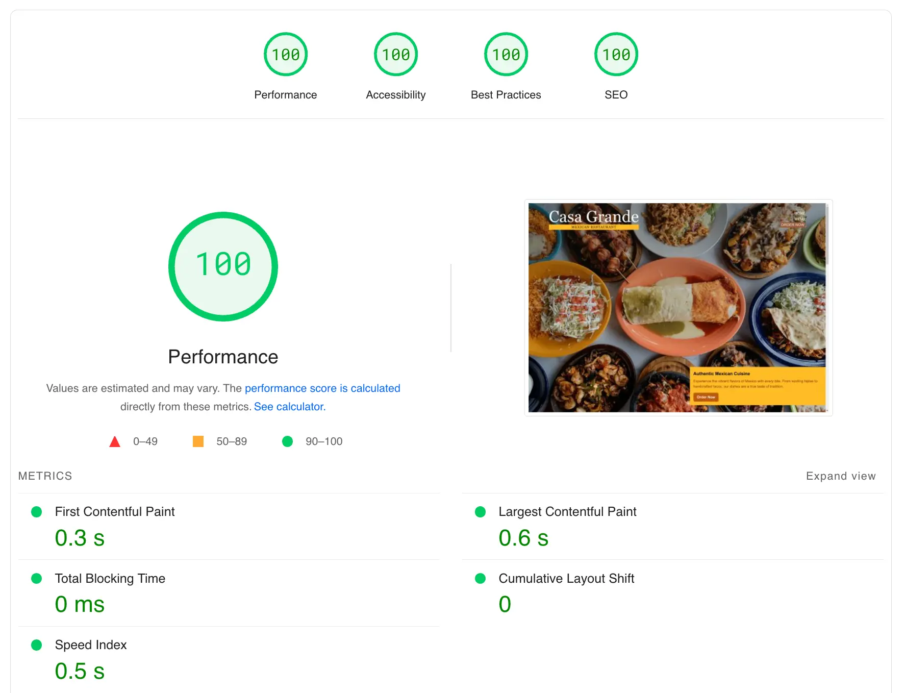

## Overview

Casa Grande, a new Mexican restaurant in Vermont, approached me with an exciting opportunity to build their first website. The owner’s goals were clear yet ambitious: to create a beautiful, user-friendly site that highlighted the restaurant’s authentic charm, showcased its diverse menu, and increased online visibility to attract local diners. With these objectives in mind, I developed a strategy to blend creative design with a high-performing technical foundation.

## Discovery and Planning

Our initial conversations revealed two primary challenges. First, Casa Grande needed a website that reflected the restaurant’s warm and welcoming atmosphere. Second, it was essential to emphasize their extensive menu, which featured over 50 dishes, without overwhelming users. After researching best practices for restaurant websites, I decided on a minimalist structure focusing on two key pages: a home page and a menu page.

The home page would provide essential details such as hours of operation, a location map, and visually striking images of the restaurant. The menu page, designed as an interactive showcase of their offerings, would feature photos of dishes and a user-friendly navigation system to make exploring the menu simple and enjoyable.

## Design and Development

The visual design of the website drew inspiration from Casa Grande’s branding. I created a warm color palette of yellow, cameo, and black to reflect the restaurant’s cozy, authentic vibe. A mobile-first approach ensured the site looked stunning and functioned flawlessly on all devices, especially smartphones, where most users would interact with it for the first time.

To ensure the site performed as beautifully as it looked, I chose [Astro](https://astro.build/), a static site generator known for its speed and efficiency. This platform allowed me to create a website that loaded quickly, ranked well in search engines, and was easy to update as the restaurant grew.

The technical foundation emphasized performance and adaptability. By building a lightweight site optimized for web vitals, I ensured fast load times and a seamless user experience across devices.

## Overcoming Challenges

As with any project, there were hurdles to address. Casa Grande had limited professional photography, so I designed the site to work well with the existing images while leaving room for future updates as more photos became available. The extensive menu posed another challenge, requiring an innovative solution to organize over 50 dishes. I developed a table of contents navigation system, allowing visitors to explore menu sections with ease and even share dishes with friends.

## Results and Impact

The finished website achieved outstanding results for Casa Grande. Within weeks of its launch, the site reached the top two Google rankings for searches like “Mexican restaurant in Vermont.” Customers frequently praised its clean design and intuitive navigation, which enhanced their overall dining experience before even stepping into the restaurant.

The site also earned a perfect web vitals score, demonstrating exceptional performance across key metrics like load speed, responsiveness and accessibility. Beyond these measurable successes, the website became a digital extension of Casa Grande’s mission: to invite the community to enjoy authentic Mexican cuisine in an approachable, engaging way.

## Conclusion

This project showcased the transformative power of thoughtful design and strategic technical implementation. By addressing Casa Grande’s immediate needs while planning for future growth, I was able to create a website that not only met but exceeded expectations. The result was more than a digital menu—it became a powerful tool to connect Casa Grande with their local community and establish a strong online presence in a competitive market.

Visit the [Casa Grande website](https://www.casagrandevt.com) to see the final product in action.

Would you like to discuss a similar project for your business? Send me a message, and let’s bring your vision to life.
